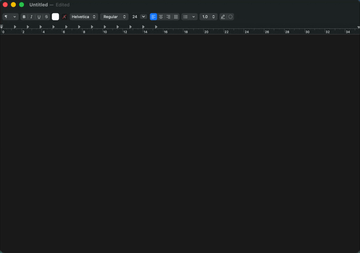
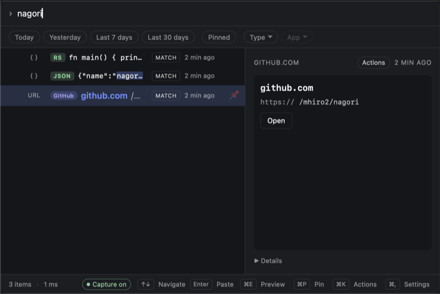
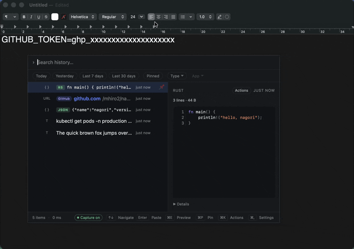
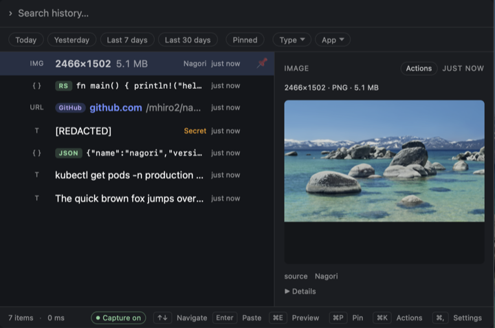
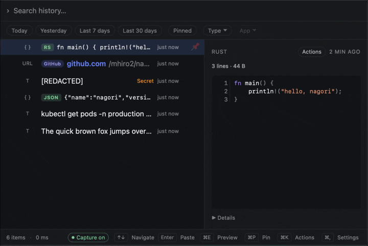

<p align="center">
  
</p>

<p align="center">
  <b>Local-first clipboard history for keyboard-driven people.</b><br/>
  Hit a hotkey, find anything you've copied, paste it back — nothing leaves your machine.
</p>

<p align="center">
  
</p>
<p align="center"><sub>Copy anywhere → <kbd>⌘⇧V</kbd> → search → <kbd>↩</kbd> pastes it back into the app you were in.</sub></p>

## What you can do

<table>
  <tr>
    <td width="50%">
      <br/>
      <b>Instant partial-match search</b><br/>
      Type part of a word and the clip surfaces at once — fast even on huge
      histories. Japanese / CJK matches kana-insensitively too — search
      ひらがな and find カタカナ — with single-kanji recall.
    </td>
    <td width="50%">
      <br/>
      <b>Secrets scrubbed before they touch disk</b><br/>
      API keys, tokens, cards and OTPs (one-time codes; detection can be
      turned off in Settings → Privacy) are redacted on capture — a clip that
      is nothing but the secret is dropped instead of stored — and clips your
      password manager marks "do not record" are skipped entirely. Everything
      stays in a local SQLite file — no cloud.
    </td>
  </tr>
  <tr>
    <td width="50%">
      <br/>
      <b>Built to be scanned</b><br/>
      Language badges on code, brand badges on known URLs, and dimensions + a
      Screenshot hint on images — the clip you want jumps out of the list.
    </td>
    <td width="50%">
      <br/>
      <b>On-device AI actions (macOS)</b><br/>
      Summarize, translate, rewrite, explain code — backed by Apple's on-device
      models. Opt-in, off by default, and nothing leaves your Mac.
    </td>
  </tr>
</table>

> [!TIP]
> **Power users:** drive all of this from the `nagori` CLI with JSON output —
> handy for scripts and AI agents. See [Usage](#usage).

## Install

Download bundles from [GitHub Releases](https://github.com/mhiro2/nagori/releases).
The `nagori` CLI ships inside the desktop bundle — there is one app to
install and update.

### macOS 26+ (Apple Silicon / Intel)

```sh
brew install --cask mhiro2/tap/nagori
```

The Homebrew cask also links the bundled `nagori` CLI onto your PATH. For a
direct `.dmg` install instead, drag **Nagori.app** to `/Applications`, then
clear the quarantine flag (the bundle is unsigned, so Gatekeeper warns on
first launch):

```sh
xattr -d com.apple.quarantine /Applications/Nagori.app
```

### Windows 10 1809+ / 11 (x86_64)

Run the NSIS installer (`.exe`) from Releases. It is not yet
Authenticode-signed, so SmartScreen warns on first launch — choose
More info → Run anyway.

### Linux (Wayland, x86_64)

```sh
# Debian / Ubuntu
sudo apt install ./nagori_*_amd64.deb wtype

# or run the AppImage directly
chmod +x Nagori_*_amd64.AppImage && ./Nagori_*_amd64.AppImage
```

Auto-paste needs the `wtype` binary on `$PATH` (`pacman -S wtype` on Arch) and
a Wayland compositor that exposes `wlr_data_control` or `ext_data_control`
(sway, Hyprland, KDE Plasma 5.27+, river, …). **GNOME Wayland and X11 are not
supported.** Global hotkeys do not register on pure Wayland (toggle the palette
from the tray icon). See [`docs/platforms.md`](./docs/platforms.md) for the
full compatibility matrix and troubleshooting.

## Usage

1. Launch the desktop app — it starts the background daemon and registers a
   global hotkey (default `Cmd+Shift+V` on macOS, `Ctrl+Shift+V` on Windows/Linux). On
   Linux Wayland the registration fails and you toggle the palette from the
   tray icon instead.
2. Press the hotkey to open the palette, type to search, arrow keys to
   navigate, **Enter** to paste the highlighted entry back into the previous
   window. **Cmd/Ctrl+Shift+Enter** pastes in an alternate format — and opens a
   picker when the entry can be pasted as more than one (files / image / text).
   **Right-click** a row for a context menu with the same actions (paste, copy,
   paste as…, pin, *Actions…*, delete) so they are reachable by mouse.
3. Use **Settings** for privacy and hotkey configuration. Run `nagori doctor`
   if something feels off; the desktop app mirrors the same capability matrix
   under **Settings → Advanced → Platform capabilities**.

The CLI talks to the running app, so writes such as `nagori add` or
`nagori paste` show up in the palette immediately (toggle under
**Settings → CLI**).

```sh
nagori list --limit 10            # recent clips
nagori search "kubectl"           # full-text search
nagori paste <id>                 # copy + auto-paste an entry
nagori capabilities               # what this OS build supports
```

Full CLI reference: [`docs/cli.md`](./docs/cli.md).

## FAQ

**Where is my data stored?**
`~/Library/Application Support/nagori` (macOS), `%LOCALAPPDATA%\nagori`
(Windows), or `$XDG_DATA_HOME/nagori` (Linux). The OS may also keep app
preferences, caches, and logs in its own platform-specific locations, but your
clipboard history stays in the data directory above.

**Is the database encrypted?**
No, and app-level encryption is intentionally deferred — **full-disk encryption
(FileVault / BitLocker / LUKS) is the at-rest baseline.** The DB has restrictive
permissions (`0600` / `0700`) but the bytes on disk are plaintext, so anything
running as your user can read your history. Keep the data directory off
cleartext sync targets — Settings → Privacy and `nagori doctor` both warn if it
sits inside iCloud Drive / Dropbox / OneDrive. Settings also offers **Delete
entries permanently**, **Purge deleted entries now**, **Clear non-pinned
history on quit**, retention limits, and **Block all sensitive captures**. The
full posture is in [`docs/privacy.md`](./docs/privacy.md) and
[`ARCHITECTURE.md` §19](./ARCHITECTURE.md#19-security-notes).

**Do the AI features send my clipboard to the cloud?**
No. The macOS-only AI actions and semantic search are opt-in (off by default)
and run Apple's on-device models locally — no clipboard text is sent to a remote
API and the Private Cloud Compute path is not used. They need macOS 26+; the
text-generation actions additionally require Apple Silicon with Apple
Intelligence enabled, while Translate and semantic search depend on
OS-downloaded language packs / embedding assets. See
[`docs/privacy.md`](./docs/privacy.md) and
[`docs/platforms.md`](./docs/platforms.md).

<details>
<summary><b>Full feature list</b></summary>

- Persistent clipboard history (text, images, file lists) stored locally in
  SQLite, searchable from a desktop palette or the `nagori` CLI.
- Japanese / CJK partial-match search: kana-insensitive (a Katakana clip is
  found by a Hiragana query and vice versa) with single-kanji recall, on top of
  full-text and ASCII fuzzy matching.
- Recall-oriented result rows: a language badge on code (JSON / SQL / Rust / …,
  detected on-device), a strong-brand badge on known URLs (GitHub / YouTube /
  …, from the hostname alone — no network), and pixel dimensions, file size,
  and a *Screenshot* hint on image rows.
- Built-in secret classifier that redacts API keys, JWTs, AWS / GitHub tokens,
  PEM blocks, credit-card numbers, and OTPs (one-time codes; the OTP check
  can be disabled in Settings → Privacy) before they are written to disk —
  a clip that redacts down to nothing but the secret is dropped rather than
  stored — plus a user regex denylist for project-specific patterns.
- Honors the "do not record" clipboard markers password managers and apps set
  on every platform (macOS, Windows, and KDE on Linux) — a marked clip is
  skipped without being stored. The exact markers are in
  [`docs/privacy.md`](./docs/privacy.md).
- Auto-paste back into the previously focused window, with a *paste as…* picker
  (**Cmd/Ctrl+Shift+Enter**) to paste a file as *Files*, *Image*, or
  *Plain text*.
- Quick actions on a selected entry, computed locally with no network calls:
  summarize, format JSON, extract tasks, redact secrets.
- macOS on-device AI actions (opt-in, off by default): summarize, rewrite,
  reformat Markdown, extract tasks, explain code, and translate — backed by
  Apple's on-device models, running entirely on your Mac.
- Optional on-device semantic search (opt-in, macOS): matches entries by
  meaning using Apple's on-device embeddings, indexed locally.
- Rich previews: image thumbnails with an expanded zoom / pan view
  (**⌘/Ctrl E**), a head / tail view for long text, safe URL display with a
  confirm-gated open, and Quick Look on macOS (**Cmd+Y**).
- Per-OS installers, with an in-app check for new releases that links you to
  the download (it does not auto-install).

</details>

## Documentation

- [`ARCHITECTURE.md`](./ARCHITECTURE.md) — workspace layout and runtime topology.
- [`docs/platforms.md`](./docs/platforms.md) — compatibility matrix and per-OS notes.
- [`docs/privacy.md`](./docs/privacy.md) — privacy model, redaction, denylist.
- [`docs/cli.md`](./docs/cli.md) — CLI reference.
- [`docs/ipc.md`](./docs/ipc.md) — IPC envelope and transport.

## License

Licensed under the [MIT License](./LICENSE).
